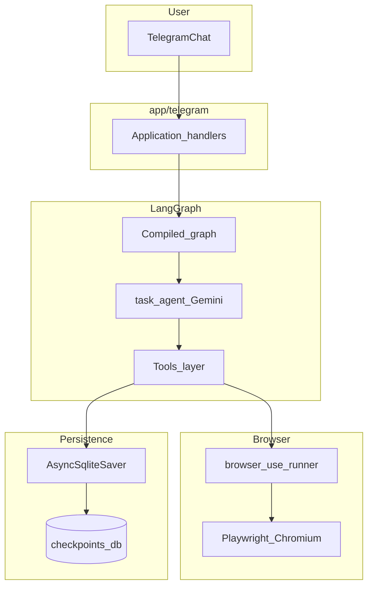

<p align="center">
  
</p>

<h1 align="center">GhostMyShit</h1>

<p align="center"><strong>Self-hosted, Telegram-controlled web automation—Gemini + LangGraph + Playwright, with human-in-the-loop when it actually matters.</strong></p>

<p align="center"><em>Shitty the Ghost: technically on it, emotionally done with your tabs.</em></p>

<p align="center">
  <a href="https://github.com/xPoleStarx/GhostMyShit/stargazers"></a>
  <a href="https://github.com/xPoleStarx/GhostMyShit/network/members"></a>
  <a href="https://github.com/xPoleStarx/GhostMyShit/issues"></a>
  
  
  
  
  
  
</p>

<p align="center">
  <code>git clone https://github.com/xPoleStarx/GhostMyShit.git</code>
</p>

---

## What it does

- **Telegram-native control** — send a task in chat; a LangGraph + Gemini agent plans and executes it.
- **Real browser automation** — [browser-use](https://github.com/browser-use/browser-use) drives Chromium via Playwright (not brittle “fake” scraping-only flows).
- **Human-in-the-loop (HITL)** — on logins, 2FA, or sensitive steps, the graph **interrupts**, sends a **screenshot + question** to Telegram, and **resumes** when you reply.
- **Live progress + stop** — short, human-friendly status lines (same language as your task) while the embedded browser agent runs. **`/stop`** / **`/dur`** requests a cooperative stop between actions/steps; **during a single LLM call** inside browser-use, shutdown may wait until that call finishes. The bot uses **concurrent Telegram update processing** so `/stop` is handled while a long `ainvoke` is still running (default single-threaded PTB would queue `/stop` until the graph call finished).
- **Self-hosted** — your machine or your container; your API keys, your data boundary.
- **Durable runs** — LangGraph checkpoints to **SQLite** (`AsyncSqliteSaver`) so conversations and state survive restarts (configurable path).

**Stack (versions):** see [`pyproject.toml`](pyproject.toml). Notable: `langchain-google-genai>=4.2` for Gemini tool-call compatibility; default model hint in [`.env.example`](.env.example).

---

## Quick start

| Platform | Command |
|----------|---------|
| **Windows** | `.\Run.ps1` (or double-click `run.bat`) |
| **Linux / macOS** | `chmod +x Run.sh && ./Run.sh` |
| **Docker** | `docker compose up --build` (`.env` at repo root) |

Before first run: copy `.env.example` → `.env` and set **`TELEGRAM_BOT_TOKEN`** and **`GOOGLE_API_KEY`**.

**Step-by-step (all paths, verification tips):** [QUICKSTART.md](QUICKSTART.md)

---

## Why GhostMyShit?

| You want… | GhostMyShit delivers |
|-------------|----------------------|
| **Control when credentials matter** | HITL interrupts instead of guessing passwords or blasting past consent screens. |
| **A real browser session** | Same cookies, same DOM, same “logged-in” reality as a human tab—via browser-use + Playwright. |
| **Ops you can reason about** | LangGraph graph + explicit tools (`run_browser_automation`, `capture_page_screenshot`, `ask_user`) and a SQLite checkpointer—not a black-box script. |
| **Keys and infra under your roof** | Self-hosted bot + self-managed Gemini/Telegram tokens; Docker option with a mounted `./data` volume. |

---

## Architecture

The Telegram layer receives text, routes it into a **compiled LangGraph** built with your settings and checkpointer. The **task agent** (Gemini, ReAct-style) calls tools: full **browser automation** (with HITL resume loops), optional **public page screenshots**, and **direct user questions** via graph `interrupt`. Persistence lives in [`app/persistence/checkpointer.py`](app/persistence/checkpointer.py); browser integration in [`app/adapters/browser_use_runner.py`](app/adapters/browser_use_runner.py); tool definitions in [`app/agent/tools.py`](app/agent/tools.py); graph wiring in [`app/graph/builder.py`](app/graph/builder.py).



**HITL path (simplified):** when browser-use returns `NEEDS_HUMAN`, the tool calls `interrupt` with question + optional screenshot; Telegram resumes the graph with your reply, feeding hints back into the same browser session thread.

---

## Contributing & license

- **Contributing:** [CONTRIBUTING.md](CONTRIBUTING.md) — Conventional Commits, PR template, security disclosure.
- **License:** [LICENSE](LICENSE) (MIT).

---

<details>
<summary><strong>Environment variables</strong></summary>

| Variable | Required | Description |
|----------|----------|-------------|
| `TELEGRAM_BOT_TOKEN` | Yes | From [BotFather](https://t.me/BotFather) |
| `GOOGLE_API_KEY` | Yes | From [Google AI Studio](https://aistudio.google.com/app/apikey) |
| `GEMINI_MODEL` | No | Default in `.env.example`: `gemini-2.5-flash`. Newer Gemini + tool flows need `langchain-google-genai>=4.2` (declared in `pyproject.toml`). |
| `PLAYWRIGHT_HEADLESS` | No | `false` = visible browser locally; usually `true` in Docker |
| `CHECKPOINT_PATH` | No | SQLite file for LangGraph; default `./data/checkpoints.db` |
| `BROWSER_MAX_STEPS` | No | browser-use step limit (default `35`) |
| `BROWSER_STEP_TIMEOUT` | No | Per-step timeout in seconds (default `180`) |

Template: [`.env.example`](.env.example)

</details>

## Telegram commands

Registered in [`app/telegram/bot.py`](app/telegram/bot.py):

| Command | What it does |
|---------|----------------|
| *(first text message)* | No `/start` required—your first message is handled by the agent. |
| `/start` | Short welcome and command hints. |
| `/tarayici` | Closes the browser-use session for this chat; the next web task starts fresh Chromium. |
| `/temizle` or `/reset` | Resets conversation context for this chat. |

## Troubleshooting

| Issue | What to try |
|-------|-------------|
| `ModuleNotFoundError` / missing packages | From repo root: `pip install -e .` or re-run `Run.ps1` / `Run.sh`. Delete `.venv` and use `-ForceInstall` if needed. |
| `langchain-google-genai` version mismatch | Reinstall with `pip install -e .`; old 2.x in the env causes resolver errors. |
| `thought_signature` / Gemini 400 after tools | Use `langchain-google-genai` 4.2+; `gemini-2.5-flash` is the smoothest default. |
| `python` / `pip` not found (Windows) | Use `Run.ps1` or set `GHOST_MYSHIT_PYTHON` to your `python.exe` full path. |
| Playwright browser missing | `python -m playwright install chromium` |
| PowerShell script blocked | `Set-ExecutionPolicy -Scope CurrentUser RemoteSigned` |
| Telegram / API errors | Verify `.env`: token and API key, no stray quotes/spaces. |

**Dependency source of truth:** [`pyproject.toml`](pyproject.toml). [`requirements.txt`](requirements.txt) exists for optional manual `pip install -r` only; `Run.ps1` / `Run.sh` install from the package definition.

## Security

Never commit `.env` (see [`.gitignore`](.gitignore)). If a token or key leaks, rotate it immediately in BotFather / Google AI Studio. Do not paste secrets into issues or PRs.

For responsible disclosure of security issues, contact the maintainer (see below) privately first.

## Manual setup & Makefile

```bash
cd GhostMyShit
python3 -m venv .venv
# Windows: .venv\Scripts\activate
# Linux/macOS: source .venv/bin/activate

python -m pip install --upgrade pip setuptools wheel
python -m pip install -e .
python -m playwright install chromium
cp .env.example .env   # Windows: Copy-Item .env.example .env
# Edit .env, then:
python -m app.main
# Or console script from pyproject: GhostMyShit
```

Dev extras: `python -m pip install -e ".[dev]"` then `python -m pytest`.

**Makefile** (if `make` is available): `make install`, `make run`, `make test`.

Full guided setup: [QUICKSTART.md](QUICKSTART.md).

---

## Maintainer

**Seyfullah Korkmaz** — [seyfullahkorkmaz115@gmail.com](mailto:seyfullahkorkmaz115@gmail.com)

Repository: [github.com/xPoleStarx/GhostMyShit](https://github.com/xPoleStarx/GhostMyShit)
